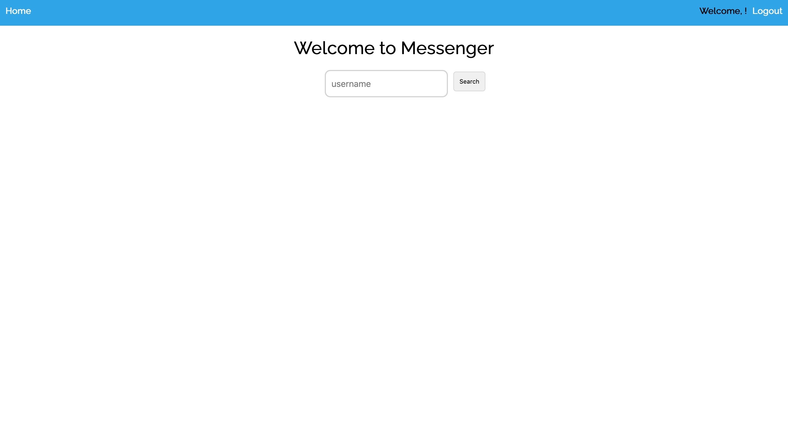

# Messenger-App

 

- **This is messenger app created with Node Js, Express JS and HTML/CSS**

- **The app provides login/register forms where users can register and Log-In**

- **Once logged into the app the users can exchange and send messages between them**

 

